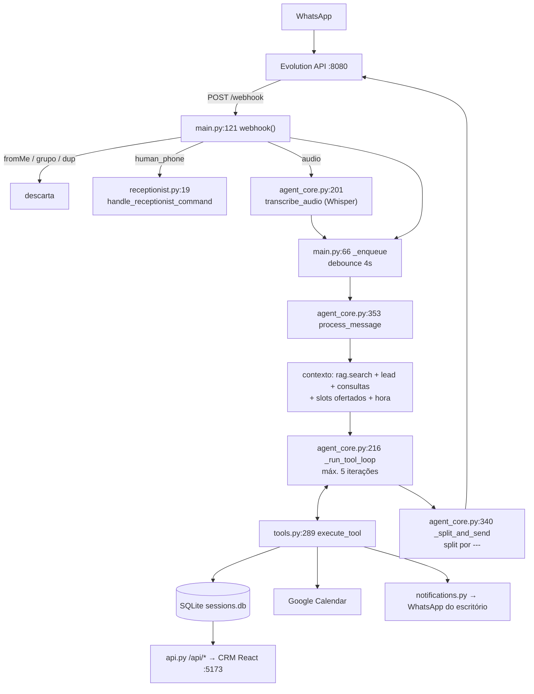

# 01 — Arquitetura

Documento descreve **o código como está** em `agent/`, `verticals/advocacia/` e
`tenants/`. Onde o código diverge do `CLAUDE.md`, o código é a fonte da verdade e a
divergência está marcada com **⚠ Divergência**.

---

## 1. O problema

Escritório de advocacia recebe primeiro contato por WhatsApp. Quem escreve está
normalmente num momento ruim (demissão, dívida, separação, acidente, parente preso) e
quer duas coisas: ser ouvido e saber o próximo passo. O escritório, do outro lado, perde
lead por três motivos: não responde fora do horário, não registra quem desistiu no meio,
e gasta tempo de advogado com triagem que uma recepcionista faria.

O produto cobre exatamente esse pedaço — **acolher, triar e agendar**. Nada além disso:
opinião jurídica, chance de êxito, valor de indenização e honorários são ato privativo do
advogado e vedados ao agente (`tenants/juris.yaml:70-77`, `prompts/base/engine_rules.md:134-143`).

### Fluxo de valor

| Etapa | Onde acontece | O que fica gravado |
|---|---|---|
| Primeiro contato | `agent/main.py:121` `webhook()` | linha em `sessions` |
| Acolhimento | prompt (`prompts/base/human_persona.md`) | — |
| Triagem | tool `save_lead_field` (`verticals/advocacia/tools.py:296`) | `lead_data` (5 campos) |
| Fechamento da triagem | tool `mark_lead_complete` (`tools.py:311`) | notificação WhatsApp ao humano |
| Agendamento | `list_available_slots` + `create_pending_appointment` (`tools.py:351`, `:366`) | `appointments` status `pending` |
| Confirmação | recepcionista responde `confirmar <id>` (`verticals/advocacia/receptionist.py:19`) ou CRM (`agent/api.py:193`) | `appointments.status = confirmed` |
| CRM / follow-up | `agent/api.py` + `sessions.get_all_leads()` (`sessions.py:344`) | `lead_status` |

O ponto central do produto: **todo telefone que falou com o agente vira lead**, inclusive
quem abandonou a conversa. `get_all_leads()` (`agent/sessions.py:344-409`) monta a lista
pela união de `lead_data`, `sessions` e `lead_status` — não exige qualificação.

---

## 2. Fluxo request → resposta

```
WhatsApp
   │
   ▼
Evolution API  (container juris_evolution, host :8081 → interno :8080)
   │  POST http://agent:3000/webhook   (evento MESSAGES_UPSERT)
   ▼
agent/main.py:121  webhook()
   ├─ descarta event != messages.upsert           main.py:126
   ├─ descarta fromMe                             main.py:132
   ├─ descarta grupo (@g.us)                      main.py:136
   ├─ dedup por key.id, TTL 24h                   main.py:140 → _is_duplicate main.py:44
   ├─ se remetente == human_phone → comando da recepcionista
   │     verticals/advocacia/receptionist.py:19 handle_receptionist_command()
   ├─ audioMessage → evolution.download_audio() → agent_core.transcribe_audio() (Whisper)
   └─ _enqueue(phone, text)                       main.py:66
          │  debounce 4s, timer reiniciado a cada mensagem
          ▼
      main.py:57 _flush_debounce()  → thread daemon
          ▼
agent_core.py:353  process_message(phone, texto_concatenado)
   ├─ escalado ativo? → repassa ao humano e sai   agent_core.py:356
   ├─ sleep(RESPONSE_DELAY=5s)                    agent_core.py:366
   ├─ rag.search(text)                            rag.py:36
   ├─ _build_lead_context / _build_appointments_context / _build_offered_slots_context /
   │  _temporal_context                           agent_core.py:140,187,170,127
   ├─ sessions.get_history(phone)  (TTL 30min, 20 msgs)   sessions.py:177
   └─ _run_tool_loop()                            agent_core.py:216
          │  até 5 iterações Claude ↔ tools
          │  verticals/advocacia/tools.py:289 execute_tool()
          │      ├─ sessions.py (SQLite)
          │      ├─ gcal.py (Google Calendar)
          │      └─ notifications.py → evolution.send_message()
          ▼
   escalado? → log_escalation + mensagem da categoria + notify_human + mark_escalated
   senão    → save_turn + _split_and_send()        agent_core.py:340
                   split por `---`, 1s entre balões
                   ▼
             evolution.py:22 send_message()
                   ▼
              Evolution API → WhatsApp
```



---

## 3. Mapa de módulos

### `agent/main.py` (245 linhas) — porta de entrada HTTP

| Expõe | Papel |
|---|---|
| `app` (Flask) | registra `api_bp` de `api.py` (`main.py:80`) |
| `GET /health` | `{"status","agent","tenant"}` — `main.py:111` |
| `GET /metrics` | Prometheus — `main.py:116` |
| `POST /webhook` | entrada da Evolution — `main.py:121` |
| `_is_duplicate(key_id)` | dedup 24h em dict de processo — `main.py:44` |
| `_enqueue` / `_flush_debounce` | debounce 4s por telefone — `main.py:66`, `:57` |
| `register_webhook()` | 10 tentativas de `POST {EVOLUTION_URL}/webhook/set/{instance}` no boot — `main.py:83` |
| `_send_daily_reminders()` | cron APScheduler 08:00 America/Sao_Paulo — `main.py:208`, agendado em `:241` |

Chama: `agent_core.process_message`, `agent_core.transcribe_audio`, `evolution.send_message`,
`evolution.download_audio`, `sessions.get_confirmed_appointments_tomorrow`,
`config.get_config`, `verticals.<vertical>.receptionist` (import dinâmico, `main.py:193`).

Contadores Prometheus definidos aqui: `messages_received_total`, `webhook_dedup_total`,
`audio_transcribed_total` (`main.py:31-33`).

> ⚠ **Divergência.** `main.py:113` responde `"agent": "lumina"` no `/health` — nome da
> engine de origem, não do tenant `juris`.

> ⚠ **Divergência.** `main.py:168`, `:181`, `:218-222` mandam mensagens com 😊 e vocabulário
> de clínica (`procedure_type` renderizado direto no lembrete). O `CLAUDE.md` proíbe emoji
> festivo e o vocabulário de "procedimento".

> ⚠ **Divergência.** `_is_from_receptionist` (`main.py:203`) casa `jid.startswith(human_phone + "@")`.
> Com JID no formato `@lid` (que o WhatsApp usa hoje no lugar do número — ver comentário em
> `api.py:68`) o prefixo não é o telefone, e os comandos `confirmar/rejeitar` da recepcionista
> não são reconhecidos.

### `agent/agent_core.py` (437 linhas) — orquestração

| Expõe | Papel |
|---|---|
| `process_message(phone, text)` | entrada principal, síncrona dentro da thread do debounce — `:353` |
| `run_test_message(phone, text, history)` | mesma lógica sem enviar WhatsApp; usada por `/api/test/message` — `:410` |
| `transcribe_audio(b64)` | Whisper via cliente OpenAI — `:201` |
| `_run_tool_loop` | loop Claude — `:216` |
| `_split_and_send` | split `---` + envio — `:340` |
| `_slot_label(iso)` | rótulo `seg, 03/08/2026 às 09:00` — `:161` (reusado por `main.py`) |
| `mark_escalated` / `is_escalated` / `clear_escalation` / `check_escalation_state` | flag de escalação em memória, TTL 30min — `:73-96` |
| `SYSTEM_PROMPT`, `_SYSTEM_CACHE` | prompt montado **uma vez no import** — `:56-57` |

Contadores: `messages_sent_total`, `escalations_total`, `leads_qualified_total`,
`appointments_created_total`, `errors_total`, histograma `llm_latency_seconds` (`:45-50`).

### `agent/prompt_builder.py` (55 linhas)

`build_system_prompt(config) -> str` (`:29`) e `load_fragment(path)` (`:13`). Lê os `.md`
relativos a `LUMINA_ROOT` (default `/app`). Detalhe camada a camada em `02-engine-do-agente.md`.

### `agent/config.py` (149 linhas)

`BusinessConfig` (dataclass, `:18`) + `get_config()` singleton (`:145`). Lê o YAML apontado
por `TENANT_CONFIG`; falha no boot se a env não existir (`:68`) ou se faltar campo
obrigatório (`:94-98`). `_parse_workdays` traduz `[seg,ter,...]` para índices `weekday()`
(`:56`). Precedência do modelo: `CLAUDE_MODEL` > `model:` do YAML > `claude-haiku-4-5-20251001`
(`:100-106`). Precedência do calendário: `calendar_id` do YAML > `GOOGLE_CALENDAR_ID` (`:126`).

> ⚠ **Divergência.** O default de `lead_fields` (`config.py:130`) ainda é
> `["nome","procedimento_interesse","indicacao"]` — herança da vertical estética. Só não
> aparece porque `tenants/juris.yaml:43` sobrescreve.

### `agent/evolution.py` (69 linhas)

`send_message(phone, text)` (`:22`), `download_audio(message_data)` (`:35`),
`notify_human(patient_phone, last_message)` (`:57`). **Nenhuma delas levanta exceção** —
falha de rede vira log e retorno silencioso (`:31`, `:53`). Lê `EVOLUTION_URL` e
`EVOLUTION_API_KEY` no import (`:13-14`); a instância vem do tenant.

### `agent/gcal.py` (284 linhas)

Service Account, sem OAuth interativo. `is_configured()` (`:24`) exige arquivo de credenciais
**e** `calendar_id` preenchido. Funções: `list_available_slots` (`:113`), `create_pending_event`
(`:199`), `confirm_event` (`:229`), `confirm_event_with_new_slot` (`:249`), `delete_event` (`:272`).
Fallback de demo em `_mock_slots` (`:76`) quando não configurado ou `DEMO_CALENDAR=true`.

### `agent/rag.py` (58 linhas)

`search(query, top_k=3) -> str` (`:36`). Índice em memória construído no import
(`_CHUNKS`, `:33`) a partir de `/app/knowledge/*.md`.

### `agent/sessions.py` (729 linhas)

Fronteira de dados entre Agente e CRM. Modelo detalhado na seção 4.

### `agent/api.py` (571 linhas)

Blueprint `api_bp`, prefixo `/api`, CORS `*` em todas as respostas (`:59-64`, `:73`).
19 rotas: `/stats`, `/leads`, `/leads/<phone>/status`, `/appointments` (+`/confirm`,
`/reject`, `/reschedule`, `/cancel`), `/conversations`, `/escalations`, `/services`,
`/professionals`, `/config`, `/query`, `/test/message`, `/test/reset`.

### `verticals/advocacia/tools.py` (456 linhas)

`get_tool_definitions(config) -> list` (`:93`) e `execute_tool(fn, args, context) -> dict`
(`:289`). Constantes públicas: `ESCALATION_CATEGORIES` (`:63`), `ESCALATION_MESSAGES` (`:40`),
`ESCALATION_MESSAGE_DEFAULT` (`:61`), `URGENCIA_LEVELS` (`:35`), `LEAD_STATUS_FORA_ESCOPO` (`:34`).
Também exporta `slot_label(iso, tz)` (`:73`), consumido por `api.py` e `receptionist.py`.

### `verticals/advocacia/notifications.py`

`notify_lead_qualified`, `notify_appointment_pending`, `notify_reschedule_pending`,
`notify_cancel_pending` — todas mandam WhatsApp para `integrations.human_phone`.

> ⚠ **Divergência.** `notifications.py:29` abre com `🎯 *Novo lead qualificado!*`.
> `receptionist.py:51` manda `Boa notícia! Seu agendamento foi confirmado 🎉` e `:93` fecha
> com 😊. `CLAUDE.md` limita a "no máximo um emoji sóbrio por conversa" e proíbe tom
> comemorativo — a regra vale, segundo o próprio `CLAUDE.md`, "para as mensagens do WhatsApp".

### `verticals/advocacia/receptionist.py` (143 linhas)

`handle_receptionist_command(text) -> bool` (`:19`). Reconhece só dois comandos, por regex
(`:15-16`): `confirmar <id>` e `rejeitar <id> [motivo]`. O efeito depende do status atual
da consulta — ver seção 4.

> ⚠ **Divergência.** Docstring `receptionist.py:2` ainda diz "vertical estética (Lumina)".

---

## 4. Modelo de dados

SQLite em `DB_PATH` (default `/app/data/sessions.db`, `sessions.py:12`), WAL,
`synchronous=NORMAL` (`:65-66`). **Todas as tabelas são criadas com `CREATE TABLE IF NOT EXISTS`
a cada `_get_conn()`** (`sessions.py:63-151`) — não há sistema de migration. Uma conexão nova
por operação, aberta e fechada.

### `sessions` — histórico bruto de conversa

| Coluna | Tipo | Significado |
|---|---|---|
| `id` | INTEGER PK | — |
| `phone` | TEXT | JID do WhatsApp (`...@s.whatsapp.net` ou `...@lid`) |
| `role` | TEXT | `user` ou `assistant` |
| `content` | TEXT | texto puro. Escalação grava o literal `[ESCALADO PARA HUMANO]` (`agent_core.py:383`); erro técnico grava `[ERRO TÉCNICO — ESCALADO PARA HUMANO]` (`:402`) |
| `ts` | REAL | epoch. `save_turn` grava assistant com `now + 0.001` para garantir ordem (`sessions.py:245`) |

Índice `idx_phone_ts`.

### `lead_data` — KV de qualificação

| Coluna | Significado |
|---|---|
| `phone` | PK composta com `field` |
| `field` | um dos `lead_fields` do tenant, **ou** `status`/`motivo_perda` gravados pela tool `marcar_fora_de_escopo` (`tools.py:334-336`) |
| `value` | texto |

Campos do tenant `juris` (`tenants/juris.yaml:43`): `nome`, `area_juridica`, `resumo_caso`,
`urgencia`, `origem`. `urgencia` é validado contra `("alta","media","baixa")` no executor
(`tools.py:301-304`) — valor fora do enum devolve erro ao Claude e não grava.

> Nota de design: `marcar_fora_de_escopo` reaproveita a tabela KV em vez de criar coluna.
> Isso significa que `lead_data` mistura campos de negócio com metadados de funil.

### `lead_status` — status explícito (decisão humana)

| Coluna | Significado |
|---|---|
| `phone` | PK |
| `status` | um de `LEAD_STATUSES` (`sessions.py:287`) |
| `motivo_perda` | só sobrevive se `status == "perdido"`; caso contrário é zerado em `set_lead_status` (`:307`) |
| `updated_at` | epoch |

**Enum `LEAD_STATUSES`** (`sessions.py:287`):

| Valor | Origem | Significado |
|---|---|---|
| `novo` | derivado | falou com o agente, não completou os 5 campos |
| `qualificado` | derivado | todos os `lead_fields` presentes em `lead_data` |
| `consulta_agendada` | derivado | tem consulta com status em `_ACTIVE_APT` (`:291`) |
| `cliente` | só explícito | decisão humana no CRM |
| `perdido` | explícito **ou** `_AGENT_STATUS` | decisão humana, ou o agente marcou fora de escopo |

**Precedência do status** (`sessions.py:383-389`, comentada em `:299`):
`lead_status` (humano) → `lead_data.status` traduzido por `_AGENT_STATUS` → derivado.
`_AGENT_STATUS` (`:295`) hoje tem uma entrada só: `fora_de_escopo → ("perdido","fora_area_atuacao")`.

**`motivo_perda` não é um enum fechado.** O único valor produzido pelo código é
`fora_area_atuacao` (`sessions.py:296`); o resto é texto livre gravado pelo CRM via
`PUT /api/leads/<phone>/status`. Além dele, `get_all_leads` devolve
`motivo_perda_detalhe` (`:399`), que é o texto livre que a tool escreveu em `lead_data.motivo_perda`.

Regra de saída do "perdido": criar consulta apaga o `lead_status` perdido
(`create_appointment`, `sessions.py:457`).

### `appointments`

| Coluna | Significado |
|---|---|
| `id` | INTEGER PK — é o número que a recepcionista digita em `confirmar <id>` |
| `phone` | JID |
| `patient_name` | nome do cliente (nome de coluna herdado da vertical clínica) |
| `procedure_type` | tipo de consulta: `Consulta inicial` / `Consulta online` |
| `slot_start`, `slot_end` | ISO 8601 com timezone |
| `new_slot_start`, `new_slot_end` | preenchidos só durante `reschedule_requested`; zerados na confirmação (`receptionist.py:69-76`) |
| `notes` | área + resumo do caso, para o advogado se preparar. Se o Claude não passar, é preenchido a partir de `lead_data` (`tools.py:376-380`) |
| `status` | ver enum abaixo |
| `external_id` | id do evento no Google Calendar; `NULL` em modo demo |
| `created_at`, `updated_at` | epoch |

**Enum de `appointments.status`** — não há constante; os valores vêm dos literais espalhados:

| Status | Quem grava | Significado |
|---|---|---|
| `pending` | `create_appointment` (`sessions.py:453`) | criado pelo agente, aguarda o escritório |
| `confirmed` | `receptionist._confirm_appointment` (`:47`) / `api.py:193` | consulta valendo |
| `reschedule_requested` | tool `reschedule_appointment` (`tools.py:422`) | cliente pediu outro horário |
| `cancel_requested` | tool `cancel_appointment` (`tools.py:443`) | cliente pediu cancelar |
| `cancelled` | confirmação de cancelamento (`receptionist.py:89`) | encerrado |
| `rejected` | recusa de um `pending` (`receptionist.py:122`) | escritório não aceitou o horário |

`_ACTIVE_APT = ("pending","confirmed","reschedule_requested","cancel_requested")`
(`sessions.py:291`) é o conjunto que conta para o funil.
`get_patient_appointments` filtra `cancelled`/`rejected` no consumidor, não no SQL
(`agent_core.py:189`, `tools.py:400`).

**Semântica de `confirmar <id>` depende do status atual** (`receptionist.py:43-99`):
`pending` → `confirmed`; `reschedule_requested` → `confirmed` com o novo slot promovido a
`slot_start`; `cancel_requested` → `cancelled`. `rejeitar <id>` faz o inverso
(`receptionist.py:110-140`), inclusive devolver um `cancel_requested` para `confirmed`.

### `escalations`

| Coluna | Significado |
|---|---|
| `id`, `phone`, `created_at` | — |
| `reason` | os primeiros 200 caracteres da mensagem do cliente (`agent_core.py:384`), **não** o `reason` que o Claude passou na tool |
| `category` | uma de `ESCALATION_CATEGORIES` |

**Enum `ESCALATION_CATEGORIES`** (`verticals/advocacia/tools.py:63`), com o texto que o cliente
recebe (`ESCALATION_MESSAGES`, `:40`):

| Categoria | Quando (prompt: `engine_rules.md:120-127`) | Particularidade da mensagem |
|---|---|---|
| `urgencia_prazo` | prisão, audiência/prazo <48h, liminar, despejo, violência | dois balões: o segundo cita 190 e 180 (`tools.py:41-46`) |
| `consulta_juridica` | insistiu em parecer/valor/prazo/honorários após duas recusas | — |
| `processo_em_andamento` | já é cliente e quer andamento do processo | — |
| `reclamacao` | crítica ao escritório | — |
| `pedido_humano` | pediu falar com pessoa (default do executor, `agent_core.py:217`) | — |
| `confusao_repetida` | repetiu 2x+ sem progresso ou se irritou | — |

`log_escalation` e `get_recent_escalations` fazem um `ALTER TABLE ... ADD COLUMN category`
dentro de `try/except` a cada chamada (`sessions.py:551`, `:575`) — migration improvisada
para bancos criados antes da coluna existir.

### `services` e `professionals` — só CRM

Nem o agente nem o prompt leem essas tabelas. São populadas no primeiro boot por
`_seed_default_data` (`sessions.py:154`) com `_INITIAL_SERVICES` (`:41`) e
`_INITIAL_PROFESSIONALS` (`:54`). `services.price` é sempre `0.0` de propósito: honorário não
entra no CRM (comentário em `sessions.py:39-40`). Os três advogados de `_INITIAL_PROFESSIONALS`
são fictícios.

### Estado que **não** está no banco

| Estado | Onde vive | Perde no restart? |
|---|---|---|
| Dedup de `key.id` (24h) | `main.py:35` `_SEEN_IDS` | sim — uma mensagem pode ser reprocessada |
| Buffer de debounce | `main.py:39` `_DEBOUNCE` | sim — mensagem em voo se perde |
| Flag de escalação (30min) | `agent_core.py:68` `_ESCALATED` | sim — cliente escalado volta a falar com o bot |
| Slots oferecidos por telefone | `sessions.py:21` `_OFFERED_SLOTS` | sim — o cliente escolhe "opção 2" e o agente re-lista |

Todos são dicts de processo único. **Rodar mais de uma réplica do agente quebra os quatro.**

---

## 5. Estado externo e modo de falha

| Dependência | Usada por | Se cair |
|---|---|---|
| **SQLite** (volume `agent_db`) | tudo | `_get_conn()` levanta; dentro de `process_message` cai no `except` genérico (`agent_core.py:399`), o cliente recebe "tive um problema técnico", o humano é notificado e o telefone entra em estado escalado. Em `api.py` vira 500. |
| **Evolution API** | `evolution.py` | **Falha silenciosa.** `send_message` engole a exceção (`evolution.py:31`) e o `messages_sent_total` é incrementado assim mesmo (`agent_core.py:348`). A conversa é gravada como respondida sem ter sido entregue. Se cair no boot, `register_webhook` tenta 10× a cada 3s e desiste com `webhook_registration_failed` (`main.py:108`). |
| **Google Calendar** | `gcal.py` | Degrada, nunca bloqueia. `list_available_slots` devolve `{"error": ...}` para o Claude (`gcal.py:196`); `create_pending_event`, `confirm_event`, `delete_event` retornam `{"ok": True}` mesmo em exceção (`:226`, `:246`, `:284`). Consequência: **a consulta é criada no SQLite mesmo que o evento nunca exista no Calendar**, sem `external_id`. Sem credenciais ou com `DEMO_CALENDAR=true`, `_mock_slots` gera 3 slots plausíveis (`:136-138`). |
| **Claude API** | `agent_core.py:285` | `messages.create` sem retry nem timeout explícito. Exceção sobe ao `except` de `process_message` (`:399`) → mensagem de erro técnico + `notify_human` + telefone marcado como escalado por 30min. O `_force_text()` de rede de segurança tem seu próprio `try` (`:279`). |
| **OpenAI Whisper** | `transcribe_audio` (`:201`) | Retorna `None`; o webhook responde pedindo texto (`main.py:168`). Sem `OPENAI_API_KEY` o cliente é construído com a chave literal `"dummy"` (`agent_core.py:53`) e toda transcrição falha. |

Ordem de acoplamento no boot: `config.get_config()` é o único ponto que **derruba o
processo** se estiver errado — `TENANT_CONFIG` ausente ou campo obrigatório faltando
(`config.py:68`, `:96`). `SYSTEM_PROMPT` também é montado no import de `agent_core`
(`:56`), então um `.md` de prompt faltando quebra a subida.

---

## 6. Variáveis de ambiente

Fonte: `.env.example` cruzado com os `os.getenv` reais do código.

| Variável | Lida em | Default | Propósito |
|---|---|---|---|
| `ANTHROPIC_API_KEY` | `agent_core.py:52` | — | cliente Claude. Sem ela, toda chamada falha em runtime (não no boot) |
| `OPENAI_API_KEY` | `agent_core.py:53` | `"dummy"` | Whisper. Vazio = transcrição de áudio desabilitada na prática |
| `CLAUDE_MODEL` | `config.py:103` | — | sobrescreve o `model:` do YAML. Precedência mais alta |
| `TENANT_CONFIG` | `config.py:67` | — | **obrigatória.** Caminho do YAML do tenant. Compose fixa `/app/tenants/juris.yaml` |
| `LUMINA_ROOT` | `prompt_builder.py:10` | `/app` | raiz para resolver `prompts/base/*.md` e `verticals/*/prompt_fragment.md` |
| `DB_PATH` | `sessions.py:12`, `seed_demo.py:17` | `/app/data/sessions.db` | arquivo SQLite. Os testes apontam para tmpdir |
| `EVOLUTION_URL` | `evolution.py:13`, `main.py:84` | `http://evolution:8080` | base da Evolution vista **de dentro** da rede docker |
| `EVOLUTION_API_KEY` | `evolution.py:14`, `main.py:85` | `""` | header `apikey` |
| `GOOGLE_CREDENTIALS_PATH` | `gcal.py:25`, `:33` | `/app/credentials/google_credentials.json` | JSON da service account |
| `GOOGLE_CALENDAR_ID` | `config.py:126` | `""` | usado só se `integrations.google_calendar.calendar_id` estiver vazio no YAML |
| `DEMO_CALENDAR` | `gcal.py:135` | `""` (compose passa `true`) | `true` força `_mock_slots` mesmo com credenciais válidas |
| `DEMO_SEED` | `main.py:231` | `""` (compose passa `true`) | roda `seed_demo.run_seed()` no boot |
| `FLASK_ENV` | `api.py:542`, `:562` | — | `production` bloqueia `/api/test/message` e `/api/test/reset` com 403 |
| `VITE_API_URL` | build arg do dashboard (`docker-compose.yml:73`) | `http://localhost:3100` | URL do agente **vista pelo browser**; congelada no bundle Vite |
| `EVOLUTION_INSTANCE` | `setup/configure_webhook.py:19` | `lumina-demo` | ⚠ **o agente não lê esta variável.** A instância vem de `integrations.evolution.instance` no YAML (`config.py:122`). Só o script de setup a usa |
| `AGENT_WEBHOOK_URL` | `setup/configure_webhook.py:20` | `http://agent:3000` | idem — `main.py:95` hardcoda `http://agent:3000/webhook` no auto-registro |

Portas publicadas (`docker-compose.yml`): Evolution `8081:8080`, agente `3100:3000`,
dashboard `5173:80`. O deslocamento é deliberado — 8080 e 3000 no host pertencem a outro
projeto (comentários em `docker-compose.yml:22`, `:38`).

Backup: container `alpine` roda `sqlite3 .backup` às 02:00 e mantém 7 arquivos
(`docker-compose.yml:95`).

---

## 7. Limitações conhecidas

- **Processo único obrigatório.** Dedup, debounce, flag de escalação e slots oferecidos
  moram em dicts de memória (seção 4). Escalar horizontalmente ou usar mais de um worker
  Flask quebra os quatro comportamentos silenciosamente.
- **`/api/query` sem autenticação.** Roda SQL read-only arbitrário no banco
  (`api.py:505-534`); o guard aceita qualquer `SELECT`/`WITH` de uma instrução só. Todo
  `/api/*` responde com CORS `*` (`api.py:60`). Exposto na rede, isso é leitura integral da
  tabela `sessions` — conversa de cliente de advogado. O `mode=ro` e o `_guard_select`
  protegem contra escrita, **não** contra leitura indevida. Bloqueador de deploy, também
  registrado no `CLAUDE.md`.
- **`make reset-db` não funciona neste repositório.** `Makefile:113` remove o volume
  `lumina-agent_agent_db`; o projeto compose aqui gera `agente-advocacia_agent_db`. O `|| true`
  esconde a falha e o banco continua intacto.
- **`make test-golden` depende de chave real.** `tests/runner.py` chama `/api/test/message`,
  que executa o Claude de verdade. Existe um `.env` na raiz do projeto (não versionado) —
  ⚠ o `CLAUDE.md` afirma que ele "não existe"; isso está desatualizado. Nada aqui foi
  executado para produzir este documento, então **não há confirmação de que os golden tests
  passam**.
- **Nenhuma migration.** O schema é recriado por `CREATE TABLE IF NOT EXISTS`; a única
  evolução de coluna existente é o `ALTER TABLE` em `try/except` de `escalations.category`
  (`sessions.py:551`). Mudar uma coluna existente exige intervenção manual no banco.
- **`get_all_leads` carrega tudo em memória** e ordena/pagina em Python (`sessions.py:404-409`,
  com `ponytail:` marcando o teto). `get_lead_status` (`:330`) chama `get_all_leads(limit=1_000_000)`
  para buscar **um** telefone.
- **Vocabulário e tom da engine não foram totalmente migrados.** Ver as divergências marcadas
  na seção 3: `/health` diz `lumina`, mensagens de sistema com emoji festivo, docstring de
  `receptionist.py`, default de `lead_fields` em `config.py`, colunas `patient_name`/
  `procedure_type`. Funcionalmente inofensivo; visível para o cliente nas mensagens.
